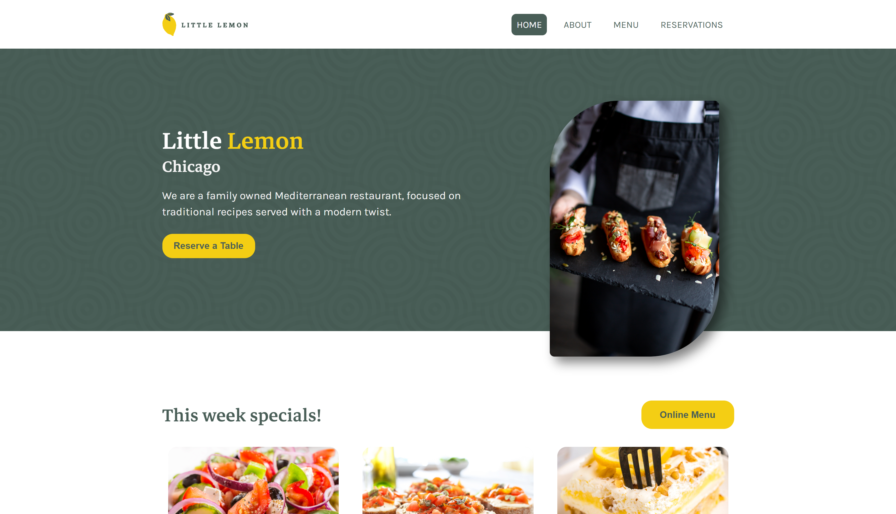
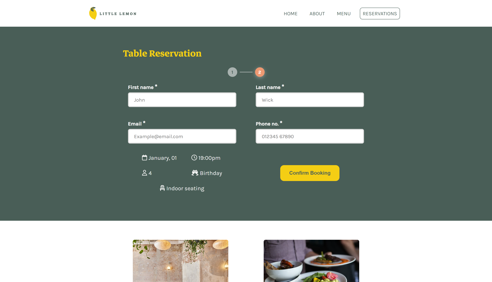

# Little Lemon Restaurant Website

### A Front-end Restaurant App. Final capstone project for Meta Front-end developer program. 


Equipped with intricate design and responsive features, including the capability to book tables with a two step form process.

### Showcase:




------

#### Install dependencies

```bash
npm install
```

#### Run the app

```bash
npm start 
```


